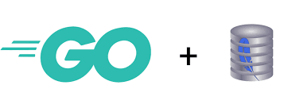

<!-- PROJECT LOGO -->
<br />
<p align="center">
  <a href="https://github.com/othneildrew/Best-README-Template">
    
  </a>

  <h3 align="center">Basic Golang SQLite clone</h3>

<!-- TABLE OF CONTENTS -->
<details open="open">
  <summary>Table of Contents</summary>
  <ol>
    <li><a href="#about-the-project">About</a></li>
    <li><a href="#getting-started">Getting Started</a></li>
    <li><a href="#roadmap">Roadmap</a></li>
    <li><a href="#license">License</a></li>
    <li><a href="#contact">Contact</a></li>
    <li><a href="#acknowledgements">Acknowledgements</a></li>
  </ol>
</details>

<!-- ABOUT THE PROJECT -->
## About The Project

insert here

<!-- GETTING STARTED -->
## Getting Started

Ensure you have >=go1.14.5

1. Clone the repo
    ```sh
    git clone https://github.com/expan75/sqlitego
    ```
2. Set gopath
3. Install dependencies
    ```sh
    go get
    ```
4. Run
    ```sh
    go run src/sqlitego
    ```

5. Check out available commands and go ham
    ```sqlitego
    sqlitego> help
    ```


<!-- USAGE EXAMPLES -->
## Usage

This is effectively just a port of a tutorial; i.e. the goal is to learn and absorb the content of the original tutorial, and learn a bit more of a new language while we're at it.

_see https://cstack.github.io/db_tutorial/ for full explanations on architecture and design._


<!-- ROADMAP -->
## Roadmap

Following along the original tutorial but implmenting a basic join as well.

<!-- LICENSE -->
## License

Distributed under the MIT License. See `LICENSE` for more information.

<!-- CONTACT -->
## Contact

Project Link: [https://github.com/expan75/sqlitego](https://github.com/expan75/sqlitego)

<!-- ACKNOWLEDGEMENTS -->
## Acknowledgements
* [OG Tutorial](https://cstack.github.io/db_tutorial/)